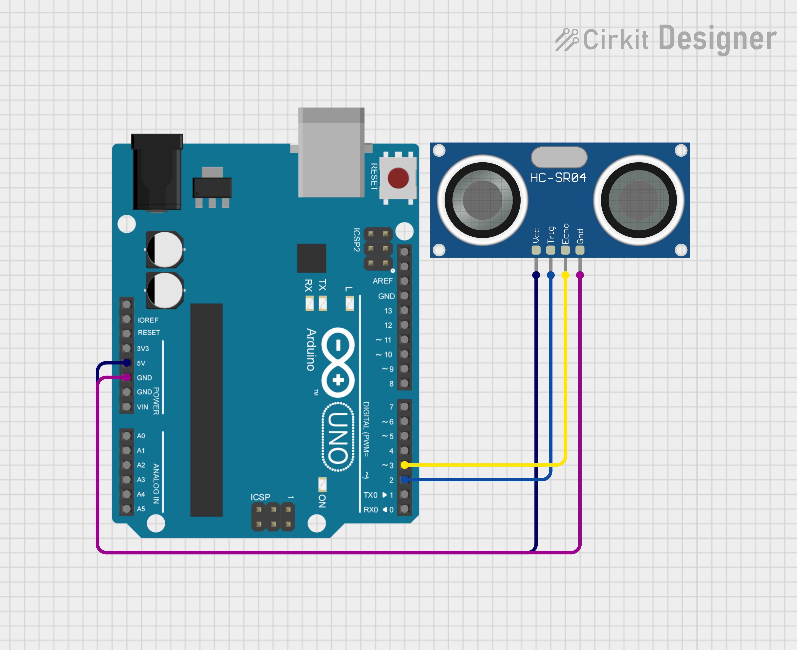

# ARCubeGestureControl

This repository contains the code for the augmented reality cube that can be moved using gestures detected from an ultrasonic sensor.

## Getting Started

### Prerequisites

Before getting started, make sure you have Unity set up on your machine, as well as the Arduino development kit. Your computer will need a webcam, either integrated or external. You would also need an arduino along with an ultrasonic sensor for this project.

### Installation and Running

Connect the ultrasonic sensor to the ardunio as shown in the image below

Connect the arduino to your computer (keep it connected while running the project) and upload the code in **UltrasonicCubeMovement.ino** to the arduino board.

Open the Unity project and run the project to start. If possible, change the image of the Ace of Spades used in the Unity project to a differnt image that is easily available to you.

When you start running and hold the selected image in front of the webcam, you should see an AR cube hover above the object. You can now move move your hand or other object towards or away from the ultrasonic sensor to see the AR cube move.
